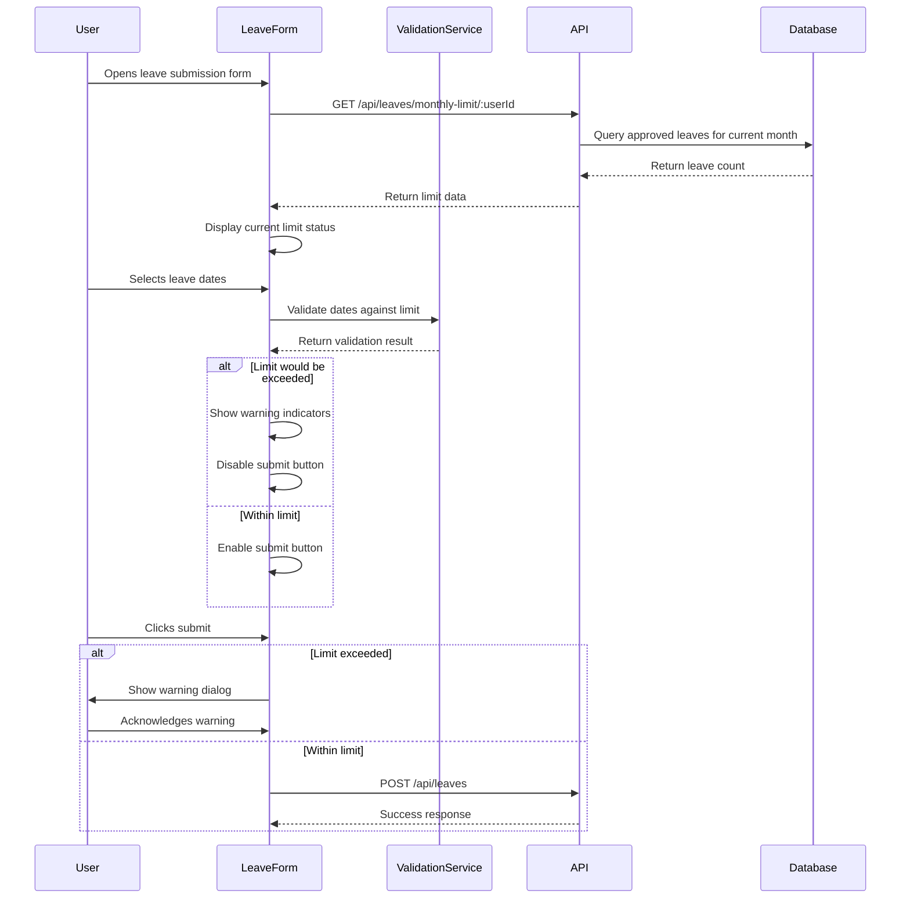

# Leave Limit Validation - Design Document

## Overview

This feature enhances the existing e-leave management system by implementing comprehensive leave limit validation with user-friendly warnings and real-time feedback. The system will prevent users from submitting leave requests that exceed their monthly limit while providing clear transparency about their leave status and remaining balance.

### Integration with Existing System

The feature builds upon the existing leave management infrastructure:
- Leverages the existing monthly leave limit API (`/api/leaves/monthly-limit/:userId`)
- Integrates with the current `LeaveLimitIndicator` component
- Extends the leave submission form with validation logic
- Maintains compatibility with the existing 3D design theme

## Architecture

### System Flow



### Component Architecture

```
LeaveSubmissionForm
├── LeaveLimitStatus (new)
│   ├── Current limit display
│   └── Real-time usage calculation
├── DateRangePicker (enhanced)
│   ├── Date selection
│   └── Real-time validation feedback
├── LeaveLimitWarning (new)
│   ├── Warning dialog
│   └── Limit exceeded message
└── SubmitButton (enhanced)
    ├── Dynamic enable/disable
    └── Warning trigger
```

## Components and Interfaces

### New Components

#### 1. LeaveLimitStatus Component

**Purpose**: Display current leave limit status within the leave submission form

**Props**:
```javascript
{
  userId: string,
  selectedDates: { startDate: string, endDate: string },
  onLimitCheck: (isWithinLimit: boolean, data: object) => void
}
```

**Features**:
- Real-time calculation of projected leave usage
- Visual indicators (green/yellow/red) based on remaining leaves
- Integration with existing `LeaveLimitIndicator` styling
- Automatic updates when dates change

#### 2. LeaveLimitWarning Component

**Purpose**: Modal dialog that appears when user attempts to submit over-limit request

**Props**:
```javascript
{
  isOpen: boolean,
  limitData: object,
  projectedUsage: number,
  onClose: () => void,
  onConfirm: () => void // Optional: allow override submission
}
```

**Features**:
- 3D styled modal matching app theme
- Clear explanation of limit policy
- Current usage vs. projected usage display
- Action buttons (Close, Submit Anyway - if allowed)

#### 3. DateRangePicker Enhancement

**Purpose**: Enhanced date picker with real-time validation feedback

**New Features**:
- Visual indicators when selected dates would exceed limit
- Tooltip warnings on date selection
- Integration with limit validation service
- Disabled state styling when limit exceeded

### Enhanced Components

#### 1. LeaveSubmissionForm (Enhanced)

**New State Management**:
```javascript
const [limitData, setLimitData] = useState(null);
const [isWithinLimit, setIsWithinLimit] = useState(true);
const [showWarning, setShowWarning] = useState(false);
const [projectedUsage, setProjectedUsage] = useState(0);
```

**New Methods**:
- `validateLeaveDates()`: Real-time validation of selected dates
- `calculateProjectedUsage()`: Calculate total leaves if request approved
- `handleSubmitWithWarning()`: Handle submission when limit exceeded
- `showLimitWarning()`: Display warning dialog

#### 2. SubmitButton (Enhanced)

**Dynamic Behavior**:
- Disabled when limit would be exceeded
- Visual styling changes based on limit status
- Warning icon when approaching limit
- Tooltip explaining why button is disabled

### API Enhancements

#### New Validation Endpoint

```javascript
POST /api/leaves/validate
Request: {
  userId: string,
  startDate: string,
  endDate: string
}
Response: {
  success: boolean,
  data: {
    isValid: boolean,
    currentUsage: number,
    projectedUsage: number,
    remainingLeaves: number,
    exceedsLimit: boolean,
    message: string
  }
}
```

**Purpose**: Validate leave request against monthly limits before submission

#### Enhanced Leave Submission

**Modified POST /api/leaves endpoint**:
- Add pre-submission validation
- Return specific error codes for limit violations
- Include override capability for admin users
- Log limit violation attempts for audit

## Data Models

### Validation Result Model

```javascript
{
  isValid: boolean,
  currentUsage: number,        // Currently approved leaves this month
  projectedUsage: number,      // What usage would be after this request
  remainingLeaves: number,     // Leaves remaining before this request
  exceedsLimit: boolean,       // Whether this request exceeds limit
  limitReached: boolean,       // Whether user has already reached limit
  message: string,             // User-friendly explanation
  canOverride: boolean         // Whether admin can override (future feature)
}
```

### Warning Dialog Data Model

```javascript
{
  title: string,
  message: string,
  currentUsage: number,
  monthlyLimit: number,
  projectedUsage: number,
  exceedsBy: number,
  allowOverride: boolean,
  warningLevel: 'info' | 'warning' | 'error'
}
```

## User Experience Flow

### 1. Form Load Experience

1. User opens leave submission form
2. System fetches current leave limit status
3. `LeaveLimitStatus` component displays current usage
4. Form shows available leave balance prominently

### 2. Date Selection Experience

1. User selects start date
2. System provides real-time feedback on date picker
3. User selects end date
4. System immediately validates date range against limit
5. Visual feedback appears (green/yellow/red indicators)
6. Submit button state updates based on validation

### 3. Submission Experience

#### Within Limit:
1. User clicks submit
2. Form submits normally
3. Success message appears

#### Exceeds Limit:
1. User clicks submit (if enabled with warning)
2. Warning dialog appears with clear explanation
3. User sees current vs. projected usage
4. User can close dialog and modify dates
5. Optional: User can submit anyway (if policy allows)

### 4. Real-time Feedback

- **Green State**: Well within limit (0-1 leaves used)
- **Yellow State**: Approaching limit (2 leaves used)
- **Red State**: At or exceeding limit (3+ leaves would be used)

## Visual Design Specifications

### Color Coding System

```css
/* Limit Status Colors */
.limit-status-green {
  --primary-color: #10b981;
  --background-color: #ecfdf5;
  --border-color: #6ee7b7;
}

.limit-status-yellow {
  --primary-color: #f59e0b;
  --background-color: #fffbeb;
  --border-color: #fcd34d;
}

.limit-status-red {
  --primary-color: #ef4444;
  --background-color: #fef2f2;
  --border-color: #fca5a5;
}
```

### 3D Design Elements

#### Warning Dialog
- Subtle 3D depth with box-shadow
- Smooth slide-in animation from top
- Backdrop blur effect
- 3D styled buttons with hover effects

#### Status Indicators
- 3D pill-shaped badges
- Subtle glow effects for different states
- Smooth color transitions
- Floating animation for critical warnings

#### Enhanced Form Elements
- 3D styled date picker with depth
- Submit button with 3D press animation
- Progress indicators with 3D styling
- Tooltip components with 3D shadows

### Responsive Design

- Mobile-first approach for warning dialogs
- Touch-friendly button sizes
- Collapsible limit status on small screens
- Accessible color contrast ratios

## Error Handling

### Client-Side Error Handling

1. **API Failures**
   - Graceful degradation when limit API fails
   - Show generic warning about checking leave balance
   - Allow form submission with server-side validation

2. **Network Issues**
   - Retry mechanism for limit checks
   - Offline state handling
   - Cache last known limit status

3. **Validation Errors**
   - Clear error messages for invalid date ranges
   - Specific messages for different limit scenarios
   - Recovery suggestions for users

### Server-Side Error Handling

1. **Validation Failures**
   - Return specific error codes for different limit violations
   - Include current limit data in error responses
   - Log validation attempts for audit trail

2. **Database Errors**
   - Fallback to default limit if calculation fails
   - Error logging for debugging
   - Graceful error responses to client

### Error Response Format

```javascript
{
  success: false,
  error: {
    code: 'LEAVE_LIMIT_EXCEEDED',
    message: 'This request would exceed your monthly leave limit',
    details: {
      currentUsage: 2,
      projectedUsage: 4,
      monthlyLimit: 3,
      exceedsBy: 1
    }
  }
}
```

## Testing Strategy

### Unit Testing

1. **Validation Logic**
   - Test limit calculation functions
   - Test date range validation
   - Test edge cases (month boundaries, leap years)

2. **Component Testing**
   - Test warning dialog behavior
   - Test real-time validation feedback
   - Test submit button state management

### Integration Testing

1. **API Integration**
   - Test limit validation endpoint
   - Test form submission with validation
   - Test error handling scenarios

2. **User Flow Testing**
   - Test complete submission flow
   - Test warning dialog interactions
   - Test real-time feedback updates

### Manual Testing Scenarios

- [ ] User with 0 leaves used can submit 3-day request
- [ ] User with 2 leaves used sees warning for 2-day request
- [ ] User with 3 leaves used cannot submit any request
- [ ] Warning dialog displays correct information
- [ ] Real-time validation updates as dates change
- [ ] Submit button enables/disables correctly
- [ ] Error handling works when API fails
- [ ] Mobile responsive design works correctly

## Security Considerations

### Client-Side Security

1. **Validation Bypass Prevention**
   - Server-side validation as final authority
   - Client validation for UX only
   - No sensitive logic in client code

2. **Data Exposure**
   - Only show user's own limit data
   - No exposure of other users' information
   - Secure API token handling

### Server-Side Security

1. **Authorization**
   - Verify user can only check their own limits
   - Admin override capabilities properly secured
   - Audit logging for limit violations

2. **Input Validation**
   - Validate all date inputs
   - Prevent manipulation of limit calculations
   - Rate limiting on validation endpoints

## Performance Considerations

### Client-Side Performance

1. **Real-time Validation**
   - Debounce date change events (300ms)
   - Cache limit data to reduce API calls
   - Optimize re-renders with React.memo

2. **Component Optimization**
   - Lazy load warning dialog component
   - Minimize DOM updates during validation
   - Use CSS transforms for smooth animations

### Server-Side Performance

1. **Database Queries**
   - Index on userId and updatedAt fields
   - Optimize monthly leave count queries
   - Cache frequently accessed limit data

2. **API Response Times**
   - Target <200ms for validation endpoint
   - Implement request caching where appropriate
   - Monitor and log performance metrics

## Implementation Phases

### Phase 1: Core Validation
- Implement validation service
- Add basic warning dialog
- Enhance submit button behavior

### Phase 2: Real-time Feedback
- Add live validation to date picker
- Implement status indicators
- Add visual feedback system

### Phase 3: Enhanced UX
- Add 3D styling and animations
- Implement mobile responsive design
- Add accessibility features

### Phase 4: Advanced Features
- Add admin override capabilities
- Implement audit logging
- Add performance optimizations

## Future Enhancements

1. **Predictive Warnings**
   - Warn users when planning leaves that might conflict
   - Suggest alternative dates within limits
   - Calendar integration for better planning

2. **Flexible Limits**
   - Configurable limits per user/role
   - Seasonal limit adjustments
   - Carry-over unused leaves

3. **Advanced Analytics**
   - Leave usage patterns
   - Limit violation trends
   - Predictive leave planning

4. **Integration Features**
   - Email notifications for limit warnings
   - Calendar blocking for over-limit dates
   - Manager notifications for limit violations